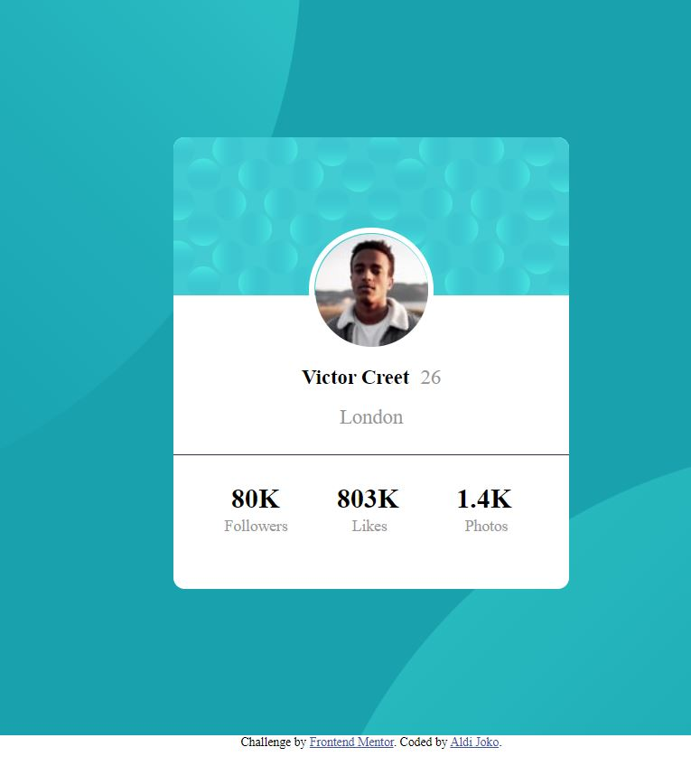

# Frontend Mentor - Profile card component solution

This is a solution to the [Profile card component challenge on Frontend Mentor](https://www.frontendmentor.io/challenges/profile-card-component-cfArpWshJ). Frontend Mentor challenges help you improve your coding skills by building realistic projects. 

## Table of contents

- [Overview](#overview)
  - [The challenge](#the-challenge)
  - [Screenshot](#screenshot)
  - [Links](#links)
- [My process](#my-process)
  - [Built with](#built-with)
  - [What I learned](#what-i-learned)
  - [Useful resources](#useful-resources)
- [Author](#author)

## Overview

### The challenge

- Build out the project to the designs provided

### Screenshot



Add a screenshot of your solution. The easiest way to do this is to use Firefox to view your project, right-click the page and select "Take a Screenshot". You can choose either a full-height screenshot or a cropped one based on how long the page is. If it's very long, it might be best to crop it.

Alternatively, you can use a tool like [FireShot](https://getfireshot.com/) to take the screenshot. FireShot has a free option, so you don't need to purchase it. 

Then crop/optimize/edit your image however you like, add it to your project, and update the file path in the image above.

**Note: Delete this note and the paragraphs above when you add your screenshot. If you prefer not to add a screenshot, feel free to remove this entire section.**

### Links

- Solution URL: [Solutin URL](https://github.com/aldijoko/profile-card-component-main)
- Live Site URL: [Profile Card](https://aldijoko.github.io/profile-card-component-main/)

## My process

### Built with

- Semantic HTML5 markup
- CSS custom properties

### What I learned

Use this section to recap over some of your major learnings while working through this project. Writing these out and providing code samples of areas you want to highlight is a great way to reinforce your own knowledge.

To see how you can add code snippets, see below:

```html
<div class="card-second" style="position: absolute; top: 40px;">
            <p style="position: absolute; left: 45px;">Followers</p>
            <p style="position: absolute; left: 158px;">Likes</p>
            <p style="position: absolute; left: 258px;">Photos</p>
</div>
```


### Useful resources

- [Multiple Background](https://www.w3schools.com/css/css3_backgrounds.asp) - This helped me for add multiple background from this challange.
- [Position Absolute](https://www.w3schools.com/cssref/pr_class_position.asp) - This is helped me for create position when the space so far between item


## Author

- Frontend Mentor - [@aldijoko](https://www.frontendmentor.io/profile/aldijoko)
- Twitter - [@aldijokosp](https://www.twitter.com/aldijokosp)


